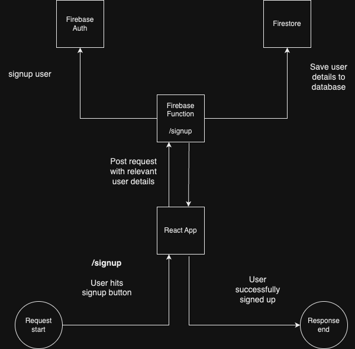

# Firebase Overview

Firebase is a Backend-as-a-Service (BaaS) platform developed by Google. It provides a variety of services and tools that developers can use to build, improve, and grow their applications. Firebase allows developers to focus on creating fantastic user experiences without having to manage the server-side of things. Here are some of the key features of Firebase:

1. **Realtime Database**: This is a NoSQL database that allows you to store and synchronize data between your users in real-time. This is ideal for applications where data needs to be synced across clients quickly, such as live collaboration tools or multiplayer games.

2. **Firestore**: This is another NoSQL database but offers more features than the Realtime Database. Firestore structures data as collections of documents and offers robust querying, offline support, and real-time updates.

3. **Authentication**: Firebase Auth provides a full-featured authentication system that supports email & password, phone number, and social login (like Google, Facebook, Twitter) and more. It also handles things like password resets, account verification, etc.

4. **Cloud Storage**: Firebase provides storage solutions for files like images, videos, and other user content. It integrates with Firebase's security and authentication to provide file uploads/downloads securely.

5. **Hosting**: Firebase Hosting provides a fast, secure, and reliable way to host your web app's static and dynamic content. It's backed by a global CDN (Content Delivery Network), offers custom domain support and SSL certificates for free.

6. **Cloud Functions**: This feature allows you to run your own custom backend code in response to events triggered by Firebase features and HTTPS requests. The code you write is stored in Google's cloud and runs in a managed environment.

7. **Analytics**: Google Analytics for Firebase offers free, unlimited reporting on up to 500 distinct events, allowing you to understand how users interact with your app.

etc..

Firebase's suite of services simplifies a lot of the challenges in web and app development. Each of these services can be used independently as per your requirements, or together, they work well as a unified platform. Their integration with other Google services also adds a lot of value. For beginners, Firebase provides a great way to learn about and implement various backend functionalities without needing to manage server infrastructure.

In this course, we'll only be focusing on three Firebase services.

- Cloud Functions
- Firestore
- Authentication

The following is an example of how these services might be used in an application to register a user

